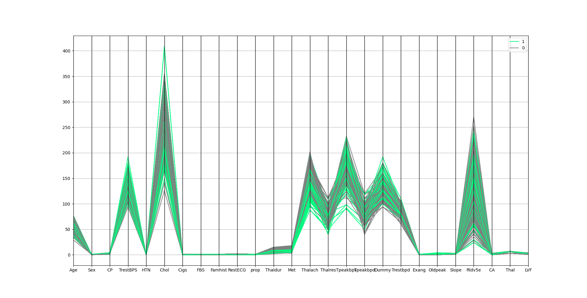
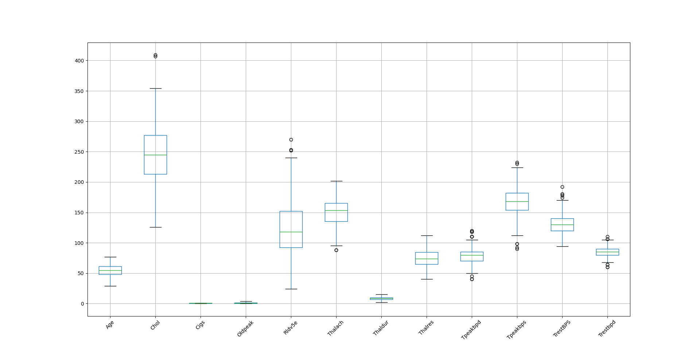
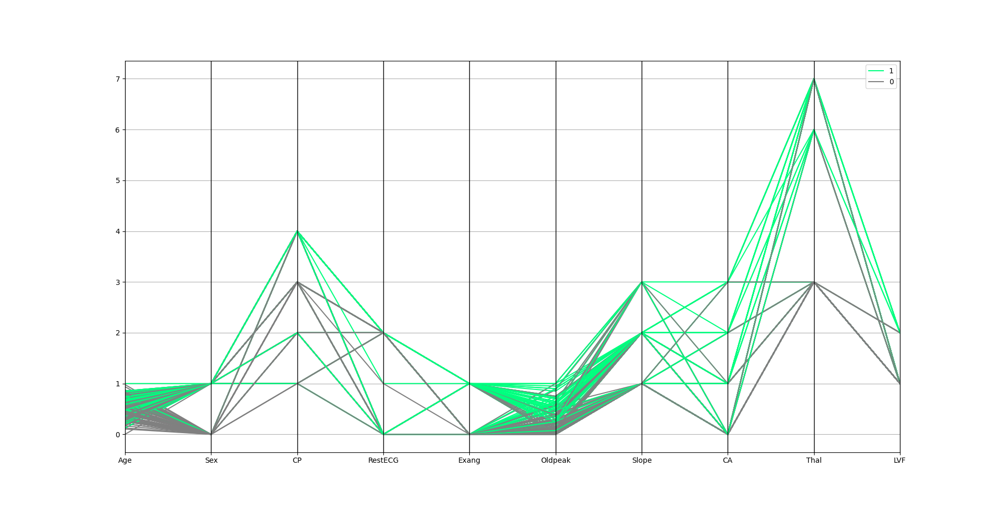
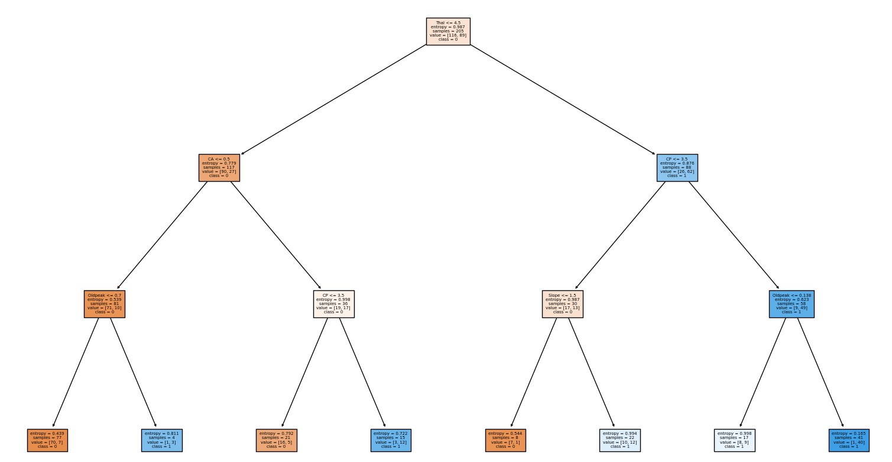

# Data-Processing-for-Heart-Disease-UCI-data-set
In this project, I worked on a part of the [Heart Disease UIC dataset](https://github.com/sharmaroshan/Heart-UCI-Dataset). This dataset tells us whether a person has heart disease or not given some symptoms. The First step is to process the data like data Cleaning, Reduction, Normalization, etc.
The second step is to build a model for data. Using sklearn library, I created a Decision tree, SVM, and KNN models and checked their performances on the dataset. 
By running the code, some plots will pop up for different steps to show you the process.
Comments in this code will help you to have a better intuition of what it does.

Important steps in preparing the data:

There are too many features in the dataset. 

Dataset before preprocessing (dataset.xls)

They make the computation expensive and the model is probably overfitted. Let's choose 10 features with the highest correlation with the target class and drop other features. Also, some features are not important to the problem, e.g. ID of patients. We don't need them as well.
    
    i = 'Class'
    x = {}
    for j in data.columns:
        if i != j:
            x[j] = data[i].corr(data[j])
    x = dict(sorted(x.items(), key=lambda item: item[1], reverse=True))
    f, j = {}, 0
    for i in x:
        f[i] = x[i]
        j += 1
        if j == n:
            break

    for i in data.columns:
        if i not in f and i != 'Class':
            data.drop(columns=[i], inplace=True)
            
Then we can detect and handle outliers using the Interquartile range or Z_Score:

    Q1 = data.quantile(0.25)
    Q3 = data.quantile(0.75)
    IQR = Q3 - Q1
    data = data[~((data < (Q1 - 1.5 * IQR)) | (data > (Q3 + 1.5 * IQR))).any(axis=1)]
    return data

    z_scores = stats.zscore(data)
    abs_z_scores = np.abs(z_scores)
    filtered_entries = (abs_z_scores < 3).all(axis=1)
    data = data[filtered_entries]
    return data

The dataset has some outliers

Now we can clean our data. e.g. if there are Nan values or irrelevant values, we replace them with the most frequent values (for categorical features) or the mean (for numerical features). Also, we delete duplicate data in our dataset.

    for i in data.columns:
        for j in data[i].unique():
            if type(j) == str:
                data.replace(j, np.nan, inplace=True)

    # Replacing NaN
    for i in data.columns:
        # if i is categorical, replace with most frequent value of i
        if i in cat:
            data[i].fillna(value=int(data[i].mode().values), inplace=True)
        # else replace with mean of i
        else:
            data[i].fillna(value=data[i].mean(), inplace=True)

    # Deleting duplicate data
    data.drop_duplicates(inplace=True)

Dataset after preprocessing (New_data.csv)

A created decision tree with max_depth = 3

Performances of different models:

Decision Tree with max_depth = 3:

Accuracy: 0.92, Recall: 0.9, Precision: 0.9, F_Score 0.9

SVM with Linear Kernel:

Accuracy: 0.88, Recall: 0.84, Precision: 0.91, F_Score: 0.87

K nearest neighbor with K = 3:

Accuracy: 0.86, Recall: 0.75, Precision: 0.94, F_Score 0.84

Thank you for your attention!
