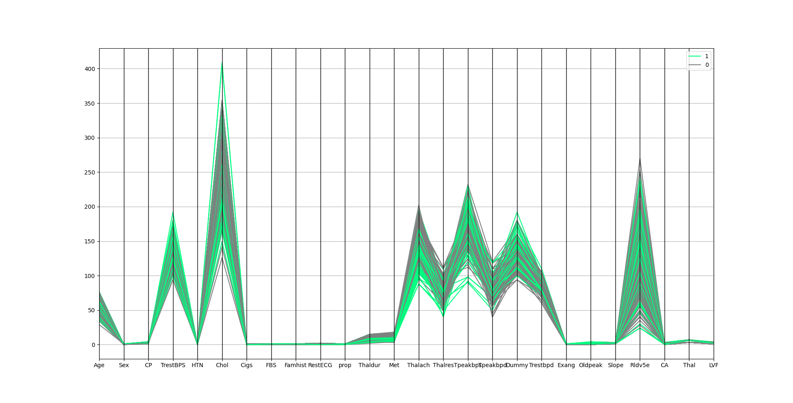
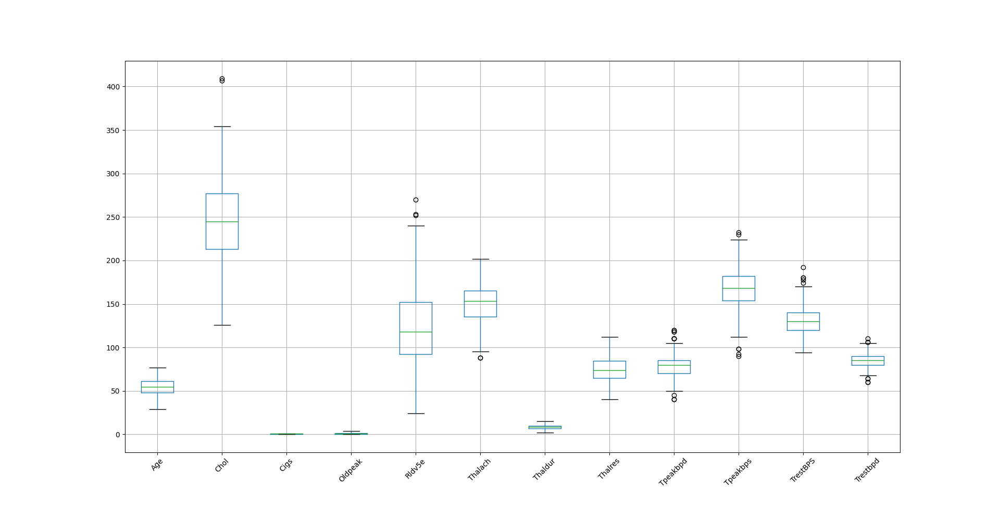
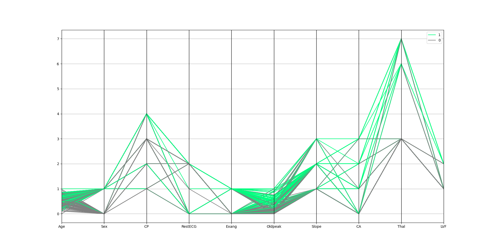

# Data-Processing-for-Heart-Disease-UCI-data-set
In this project, I worked on a part of the Heart Disease UIC dataset. The First step is to process the data like data Cleaning, Reduction, Normalization, etc. 
The second step is to build a model for data. Using sklearn library, I created a Decision tree, SVM, and KNN models and check their performances on the dataset. 
By running the code, some plots will pop up for different steps to show you the process.
Comments in this code will help you to have a better intuition of what it does.
Thank you!

Dataset before preprocessing (dataset.xls)

Dataset has some outliers

Dataset after preprocessing (New_data.csv)

A created decision tree with max_depth = 3

